# 5. Conceptual DB Design - ER Diagram (Release 1)

PostgreSQL 17, schema in [`aiops-api/app/schema.sql`](../aiops-api/app/schema.sql). The design is product-neutral:
every entity, attribute and relationship below maps 1:1 to a relational table or to a document collection.
Crow's-foot notation; the model is split into six views so no relationship lines cross. Entities that
appear in more than one view (TEAM, SERVICE, HOST, INCIDENT) are the same table, shown with only the keys the view needs.

Each view is also rendered as an SVG next to this file.

### 5.1 Services, hosts and deployments


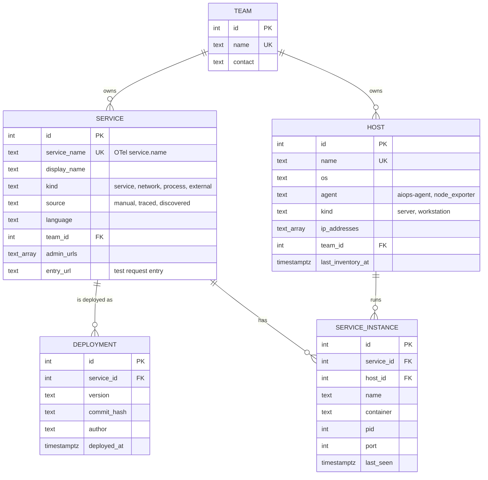

### 5.2 Network topology seen by host agents


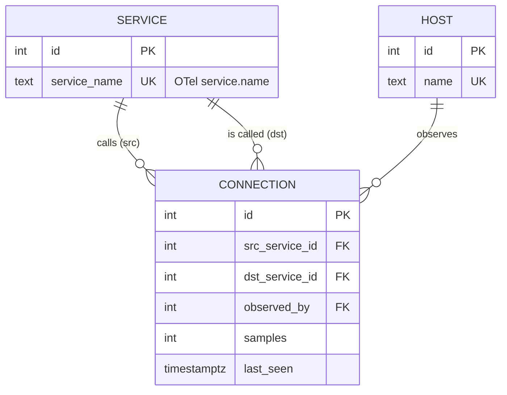

### 5.3 Incident context - who owns it, what it is about, which skill investigates


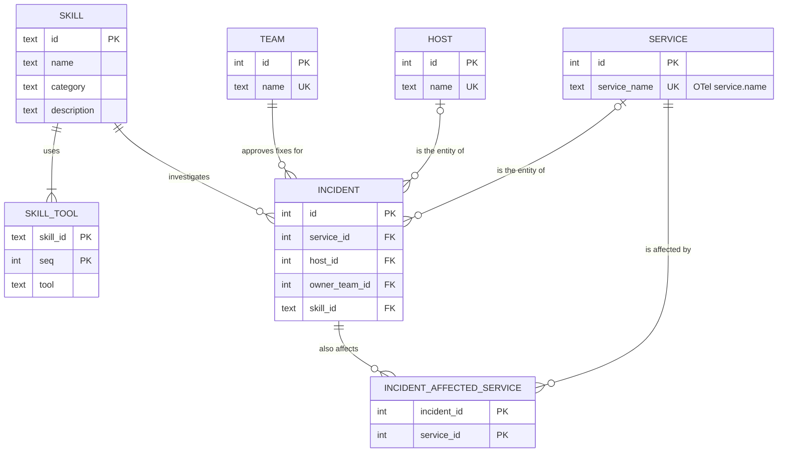

### 5.4 Incident and what the AI found


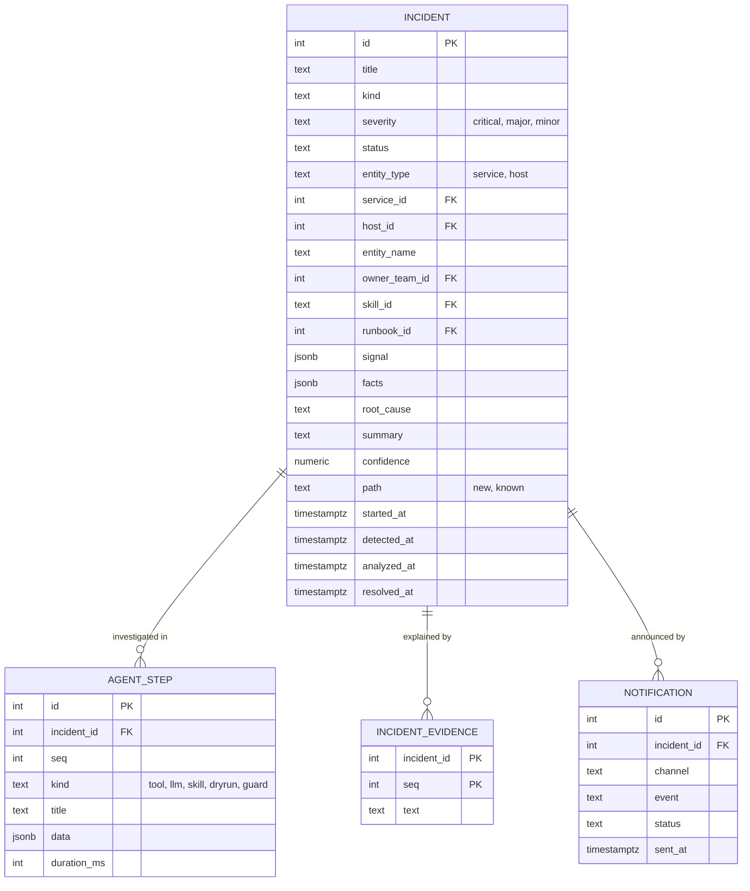

### 5.5 Fix and owner approval


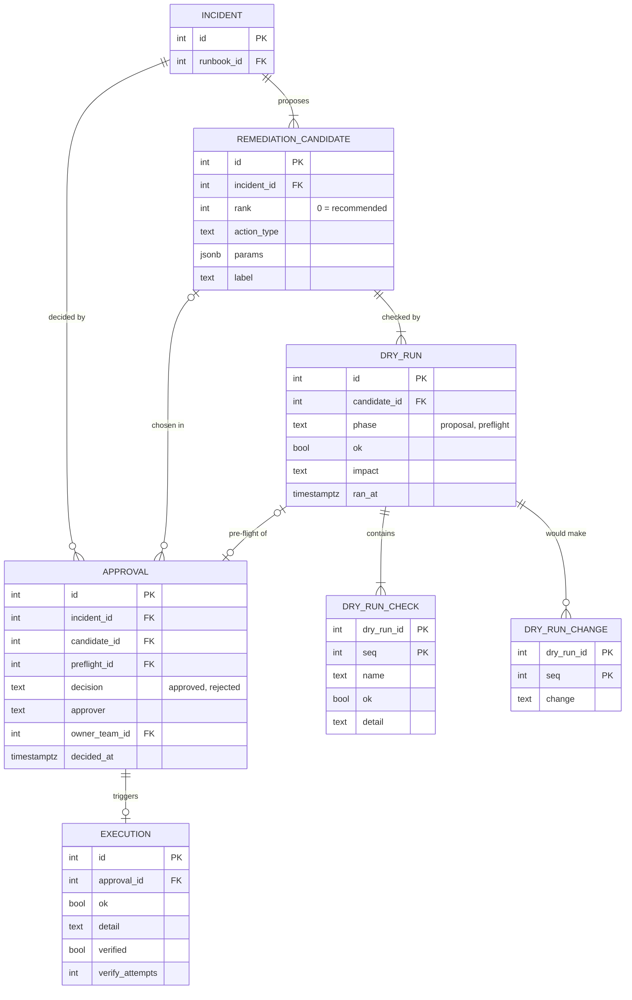

### 5.6 Learning - feedback and runbook memory


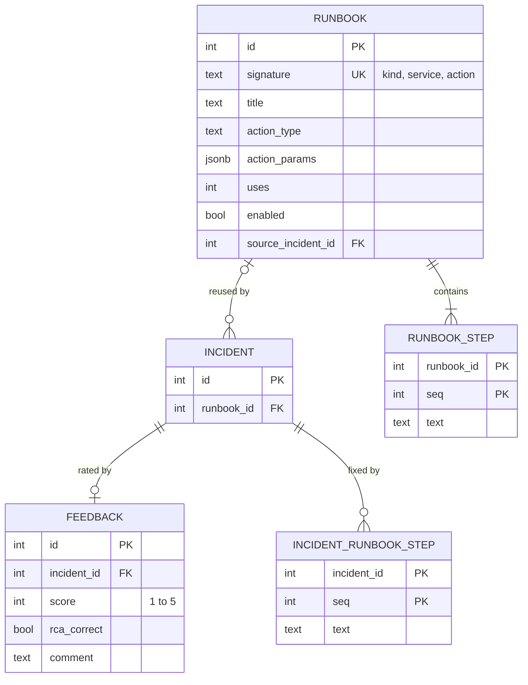

## Why it is shaped this way

| Decision | Reason |
|---|---|
| **M:N "incident also affects services" resolved with INCIDENT_AFFECTED_SERVICE** | An associative entity instead of a many-to-many line, as in a normalized relational design. |
| **Incident is the aggregate root**; evidence, runbook steps, agent steps, candidates, approvals, feedback hang off it | One incident page = one aggregate. Everything is deleted with the incident (`ON DELETE CASCADE`). |
| **Dry run is its own entity with checks and changes as child rows** | The same candidate is dry-run twice (`proposal` by the agent, `preflight` right before execution); auditors can see both and compare. |
| **Approval → Execution (1:0..1)** | A rejection has no execution; an approval always records what was run and whether it was verified. |
| **Owner is a Team, referenced from Service, Host and Incident** | Ownership is copied onto the incident at analysis time, so history stays correct if a service later changes owner. |
| **`entity_name` kept on Incident besides the FK** | The FK is `SET NULL` when a service is deleted; the incident still says what it was about. |
| **Service kinds `service / network / process / external`, source `manual / traced / discovered`** | Traced apps, network devices, processes found by the host agent and external databases all share the map, the health checks and the incidents. |
| **Connection (service → service) observed by a Host** | Lines on the service map for apps that do not run OpenTelemetry yet. |
| **Runbook score is derived, not stored** | Average of `FEEDBACK.score` over incidents that reused the runbook: no counters to drift. |
| **`signal`, `facts`, `params`, `data` are JSONB** | They are snapshots whose shape depends on the skill/action (evidence of what the AI saw), not data we query by column. |
| **Metrics, logs and traces are not in this database** | They live in Prometheus, Loki and Tempo; the database keeps only decisions and their evidence. |

Release 2-3 candidates (not built): `USER` + `TEAM_MEMBER` for real owner sign-in (replaces the owner switch), `SILENCE` / maintenance windows, `SLO` per service.
