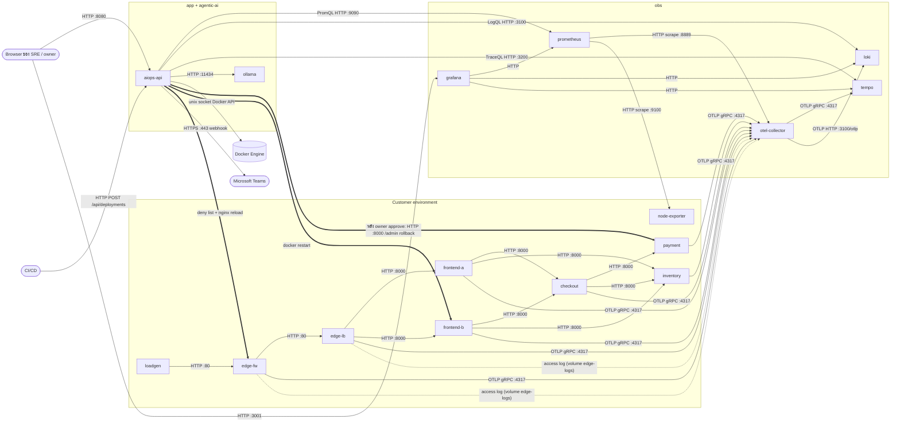

# 2. Infrastructure: Architecture

AIOps One Solution — Agentic AI Root Cause Analysis for Incidents (PoC)
สถานะ ณ 6 ต.ค. 2026 อ้างอิงระบบที่ deploy อยู่จริงบน VM CP26PT1

---

## 1. Environment ที่มี

| Environment | สถานะ | ใช้ทำอะไร |
|---|---|---|
| **dev / PoC** | ใช้งานอยู่ | ที่เดียวที่ deploy จริงตอนนี้ ใช้พัฒนา ทดสอบ chaos scenario และ demo |
| UAT | ยังไม่มี (แผน) | ถ้าได้ resource เพิ่ม จะแยก VM เพื่อลองต่อกับระบบลูกค้าจริงก่อนขึ้น production |
| production | ยังไม่มี (แผน) | ใช้สถาปัตยกรรม Kubernetes ตามสไลด์ แบ่งเป็น namespace app / obs / agentic-ai |

ตอนนี้มี environment เดียว เพราะ resource ที่ได้มาพอสำหรับ VM เครื่องเดียว

## 2. Host ที่ใช้ในแต่ละ Environment

| Environment | Host | Spec | ที่ตั้ง |
|---|---|---|---|
| dev / PoC | `CP26PT1.sit.kmutt.ac.th` (10.4.82.20) | Ubuntu 26.04 LTS · 4 vCPU · 7.2 GB RAM · 76 GB disk · ไม่มี GPU | VM ของคณะ SIT, KMUTT (on-premise) เข้าได้จากเครือข่ายคณะหรือ VPN เท่านั้น |

Firewall ของ host (ufw) เปิดแค่ 22/tcp (SSH), 8080/tcp (Web app), 3001/tcp (Grafana) และ 4317–4318/tcp (OTLP สำหรับรับ telemetry จากลูกค้า)

## 3. มีการใช้ Container ไหม

ใช้ ทุก component รันเป็น Docker container บน Docker Engine 29.1 จัดการด้วย Docker Compose 2.40 ทั้งหมด 17 containers อยู่ใน docker network `aiops` (bridge) เดียวกัน

ไม่ใช้ Kubernetes เพราะ 4 vCPU / 7 GB ไม่พอรัน control plane คู่กับ LLM แต่ยังแบ่ง container เป็นกลุ่มเดียวกับ namespace ในสไลด์

| กลุ่ม (เทียบ namespace) | Containers |
|---|---|
| **app**: platform web app | `aiops-api` |
| **agentic-ai** | `ollama` (LLM) และ detector/agent ที่รันอยู่ใน `aiops-api` |
| **obs**: observability | `otel-collector`, `prometheus`, `loki`, `tempo`, `grafana`, `node-exporter` |
| **customer environment** (ระบบลูกค้าจำลองสำหรับ demo) | `edge-fw`, `edge-lb`, `frontend-a`, `frontend-b`, `checkout`, `payment`, `inventory`, `loadgen` |

## 4. Services, port และ protocol

| Container | Image | หน้าที่ | Port (container) | Port บน host | Protocol |
|---|---|---|---|---|---|
| aiops-api | aiops-api (Python 3.12, FastAPI) | Web UI, REST API, anomaly detector, agentic RCA, dry run และ remediation | 8080 | **8080** | HTTP (HTML + REST/JSON) |
| ollama | ollama/ollama | LLM `qwen2.5:1.5b` บน CPU (จำกัด 3 cores) | 11434 | - | HTTP/JSON (Ollama API) |
| otel-collector | otel/opentelemetry-collector-contrib 0.120 | รับ telemetry, แปลง traces เป็น metrics (spanmetrics), อ่าน log firewall/LB | 4317, 4318, 8889 | **4317, 4318** | OTLP/gRPC (4317), OTLP/HTTP (4318), HTTP Prometheus exposition (8889) |
| prometheus | prom/prometheus 3.5 | เก็บ metrics, เก็บ 3 วัน | 9090 | 127.0.0.1:9090 | HTTP (scrape + PromQL API) |
| loki | grafana/loki 3.5 | เก็บ logs, เก็บ 72 ชม. | 3100 | - | HTTP (OTLP ingest `/otlp`, LogQL API) |
| tempo | grafana/tempo 2.8 | เก็บ traces, เก็บ 48 ชม. | 3200, 4317 | - | HTTP (TraceQL API), OTLP/gRPC (ingest) |
| grafana | grafana/grafana 12.1 | Dashboards / Explore | 3000 | **3001** | HTTP |
| node-exporter | prom/node-exporter 1.9 | Metrics ของ host (CPU, RAM, disk) | 9100 | - | HTTP (`/metrics`) |
| edge-fw | nginx 1.29 + otel module | Firewall: deny list และ access log | 80 | - | HTTP · ส่ง span ด้วย OTLP/gRPC |
| edge-lb | nginx 1.29 + otel module | Load balancer แบบ round-robin ไป frontend-a/b | 80 | - | HTTP · ส่ง span ด้วย OTLP/gRPC |
| frontend-a, frontend-b | aiops-demo-app (Python, Flask) | Web/API gateway ของร้านค้า (2 replicas) | 8000 | - | HTTP REST/JSON · ส่ง traces/logs ด้วย OTLP/gRPC |
| checkout | aiops-demo-app | สร้าง order | 8000 | - | HTTP REST/JSON |
| payment | aiops-demo-app | ตัดเงิน | 8000 | - | HTTP REST/JSON |
| inventory | aiops-demo-app | สต็อกสินค้า | 8000 | - | HTTP REST/JSON |
| loadgen | aiops-demo-app | จำลองผู้ใช้และผู้โจมตี | 8000 | - | HTTP |

ช่องทางอื่นที่ไม่ใช่ network port:
- `aiops-api` → Docker Engine ผ่าน unix socket `/var/run/docker.sock` (Docker Engine API) ใช้ดู stats, restart container และรัน `nginx -t` / `nginx -s reload` บน firewall
- `edge-fw` / `edge-lb` → `otel-collector` ผ่าน shared volume `edge-logs` (access log เป็น JSON lines ทีละบรรทัด)
- `aiops-api` ↔ `edge-fw` ผ่าน bind mount `./edge` (deny list และ config ที่ใช้ตอน dry run)

## 5. ความสัมพันธ์ของแต่ละ Container/Service (ลูกศรคือทิศทาง request)

ลำดับการทำงานตอนเกิด incident:
1. ลูกค้าเรียก **edge-fw → edge-lb → frontend-a/b → checkout → payment/inventory** ทุก hop ส่ง span ไป **otel-collector** และ firewall/LB เขียน access log
2. **otel-collector** ส่ง traces ไป Tempo และ logs ไป Loki ส่วน spanmetrics ให้ Prometheus มา scrape
3. **aiops-api** (detector) query Prometheus ทุก 15 วินาที เมื่อเจอ anomaly จะเปิด problem แล้ว agent เรียก tools แบบ read-only (PromQL, LogQL, TraceQL, Docker stats) และใช้ **ollama** ช่วยสรุป
4. Agent **dry run** ทุกวิธีแก้ แล้วแจ้ง **Teams** และหน้า web ให้ owner ตัดสินใจ
5. หลัง owner approve ระบบจะ dry run ซ้ำ (pre-flight) แล้วค่อยแก้จริง: rollback ผ่าน `/admin`, restart ผ่าน Docker API หรือ block IP ที่ firewall แล้ว verify จาก metrics

## 6. External Entity

| Entity | ใช้ทำอะไร | Protocol | สถานะ |
|---|---|---|---|
| **Microsoft Teams** (Incoming Webhook / Workflows) | ส่ง Adaptive Card ตอน detect, RCA พร้อม และ resolved | HTTPS POST :443 ขาออก | รองรับแล้ว แต่ยังไม่ได้ใส่ webhook URL |
| **Docker Hub** | ดึง image ตอน deploy | HTTPS :443 ขาออก | ใช้ตอน build/deploy |
| **Ollama model registry** (`registry.ollama.ai`) | ดาวน์โหลด model `qwen2.5:1.5b` ครั้งแรก | HTTPS :443 ขาออก | ใช้ครั้งเดียว ตอน runtime ไม่ต้องใช้ |
| **PyPI** | ติดตั้ง Python packages ตอน build image | HTTPS :443 ขาออก | ใช้ตอน build |
| **Google Fonts** | font ของหน้าเว็บ (browser โหลดเอง) | HTTPS :443 จาก browser | ไม่มีก็แสดงผลได้ (fallback font) |
| **เครือข่าย / DNS / VPN ของ KMUTT** | เข้าถึง VM | SSH :22, HTTP :8080/:3001 | จำเป็น |
| **CI/CD ของลูกค้า** (เช่น GitLab CI) | แจ้ง version + commit หลัง deploy | HTTP POST `/api/deployments` | มี API แล้ว ตอน demo ใช้ chaos panel แทน |
| Identity provider (เช่น MS Identity Platform) | login / RBAC สำหรับ owner approval | OIDC | **ยังไม่มี** (out of scope ของ PoC) |
| ระบบลูกค้าจริง (firewall/LB/app ภายนอก) | ส่ง telemetry เข้า collector | OTLP :4317/:4318, scrape :9100 | รองรับผ่านหน้า Connect App / Connect Infrastructure |

LLM รันในเครื่อง (Ollama) จึงไม่ต้องใช้ LLM API ภายนอก และข้อมูล incident ของลูกค้าไม่ออกจาก host

---

## ความสอดคล้องกับโครงงาน

| สิ่งที่โครงงานต้องการ (สไลด์) | สถาปัตยกรรมรองรับยังไง |
|---|---|
| C1 Late detection | detector ทุก 15 วินาที ใช้ adaptive baseline · วัดได้ว่า detect ภายใน 35–50 วินาที |
| C2 Scattered telemetry | metrics, logs, traces, firewall/LB logs และ deploy history รวมอยู่ใน obs stack เดียว ผูกกันด้วย trace_id |
| C3 Manual RCA | agent เลือก skill แล้วเรียก tools อัตโนมัติ · RCA ใช้เวลา 1–2 นาที ถ้าเคยเจอ pattern นี้แล้วใช้ 23 วินาที |
| C4 Hidden change impact | ทุก span มี `app.version` / `app.commit` และ CI ส่ง deploy event เข้ามา |
| C5 Multi-team handoffs | หน้า Problem เดียวมีทั้ง RCA, dry run และ owner approve · แจ้ง Teams ไปที่ owner |
| C6 Growing toil | runbook memory + scoring · ตาม OUT scope คือไม่แตะ source code และไม่ทำงานเองโดยไม่มีคนอนุมัติ |
| Resource ที่ได้ (4 vCPU / 7 GB / ไม่มี GPU) | ใช้ Docker Compose แทน K8s · LLM 1.5B บน CPU · ทุก container ตั้ง memory limit ไว้ · ตอนปกติใช้ CPU ราว 4% และ RAM ราว 20% |
